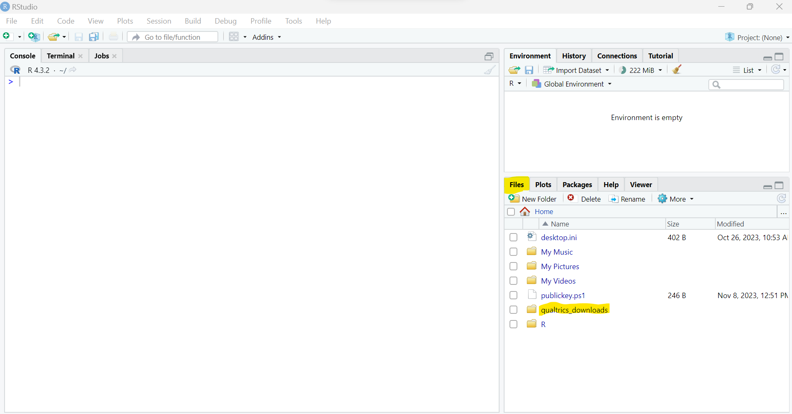
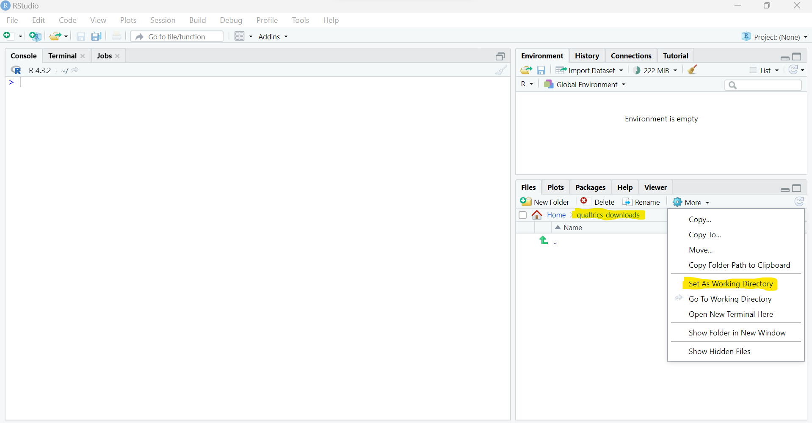

## cslqualtrics

**R-based tools to visualize Qualtrics behaviour observation data**

### overview

Presented here is an R-based tool to format data collected in Qualtrics so as to be compatible with the data structure expected by a Observation Query Excel spreadsheet that is used to visualize patterns in the observation data. The formatting function requires as inputs the name of the file, along with the year and semester associated with the observation data. The output is a tabular csv file appropriately named with the class type, year, and semester in the working directory and of a format in keeping with existing data. The formatted file can then be transferred to a directory holding files from other classes, semesters that have similar formatting that are sourced by the Observation Query Excel spreadsheet.

### installation

An installation of R and several libraries are required. The following steps need to be run only once on any given computer.

1. The easiest way to interface with R, particularly on machines running Windows, is through the RStudio IDE. Instructions for installing R and RStudio are available through [Posit](https://posit.co/download/rstudio-desktop/), or they can be accessed through the [ASU software center](https://ets.engineering.asu.edu/softwareage/software/). 

2. Once R and RStudio are installed, install the `remotes` library to facilitate installing the cslqualtrics library to format the Qualtrics data.

*Install the `remotes` library by issuing the command `install.packages("remotes")` in the RStudio interface.*

3. Use the `remotes` library to install the cslqualtrics library from GitHub that has the formatting tools.

*Install the `cslqualtrics` library by issuing the command `remotes::install_github("srearl/cslqualtrics")` in the RStudio interface.*

### application

### file navigation

1. Using the Files tab within the RStudio interface, navigate to the directory where the files downloaded from Qualtrics are located.

*Navigate to the directory where the files downloaded from Qualtrics are located (`qualtrics_downloads` in this example)*

2. Under the `More` tab, select the option to `Set As Working Directory` to make the directory where the Qualtrics files have been downloaded the active directory.

*Set the directory where the Qualtrics files have been downloaded as the working directory*
