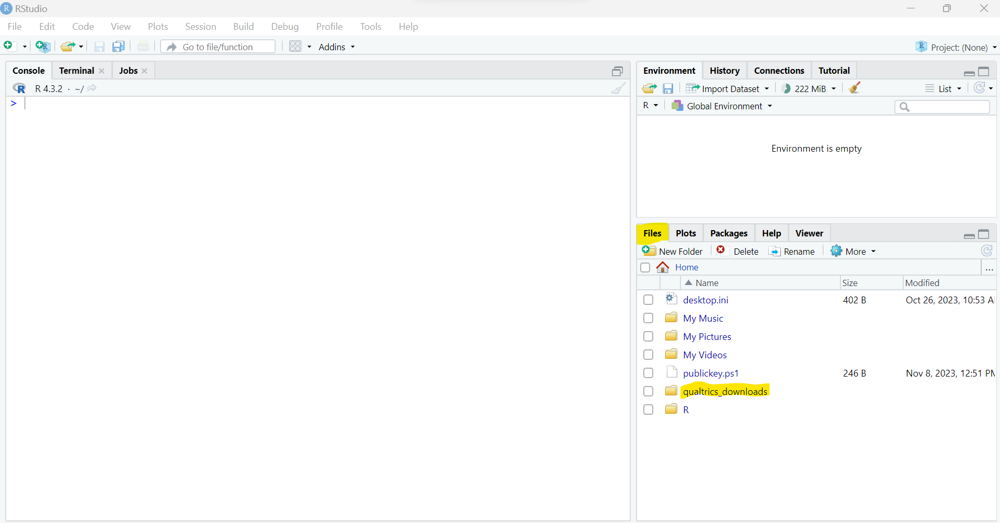
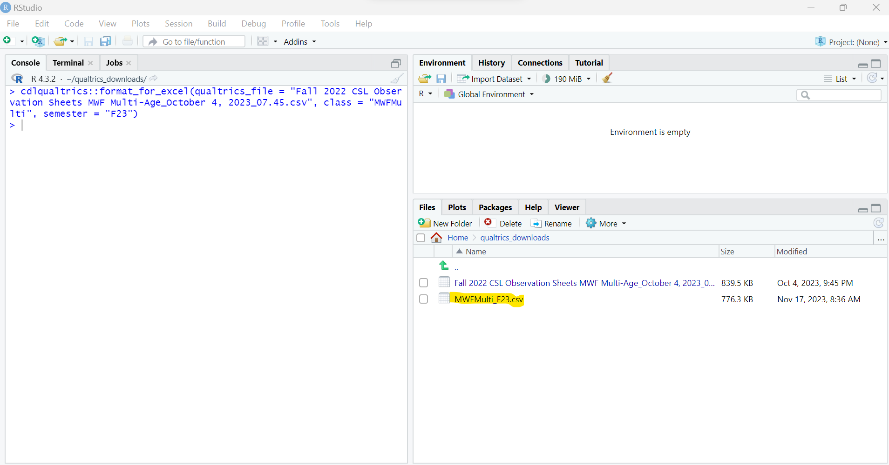
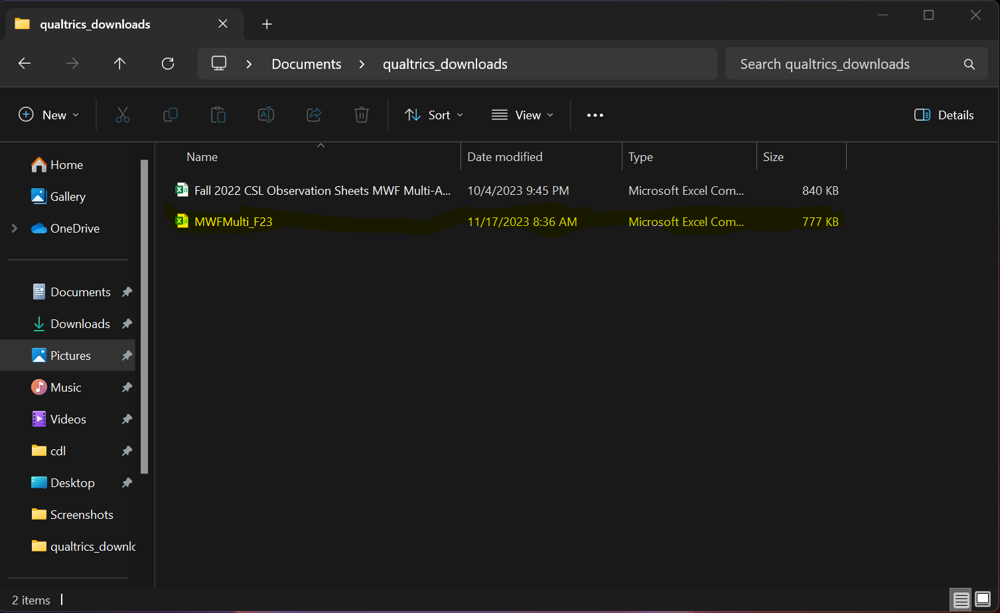

```{r, include = FALSE}
knitr::opts_chunk$set(
  collapse = TRUE,
  comment = "#>"
)
```

```{r setup}
library(cslqualtrics)
```


## cslqualtrics

**R-based tools to format Qualtrics behaviour observation data**

### overview

Presented here is an R-based tool to format data collected in Qualtrics so as to be compatible with the data structure expected by a Observation Query Excel spreadsheet that is used to visualize patterns in the observation data. The formatting function requires as inputs the name of the file, along with the year and semester associated with the observation data. The output is a tabular csv file appropriately named with the class type, year, and semester in the working directory and of a format in keeping with existing data. The formatted file can then be transferred to a directory holding files from other classes, semesters that have similar formatting that are sourced by the Observation Query Excel spreadsheet.

### installation

An installation of R and several libraries are required. The following steps need to be run only once on any given computer.

1. The easiest way to interface with R, particularly on machines running Windows, is through the RStudio IDE. Instructions for installing R and RStudio are available through [Posit](https://posit.co/download/rstudio-desktop/), or they can be accessed through the [ASU software center](https://ets.engineering.asu.edu/softwareage/software/). 

2. Once R and RStudio are installed, install the `remotes` library to facilitate installing the cslqualtrics library to format the Qualtrics data.

*Install the `remotes` library by issuing the command `install.packages("remotes")` in the RStudio interface.*

3. Use the `remotes` library to install the cslqualtrics library from GitHub that has the formatting tools.

*Install the `cslqualtrics` library by issuing the command `remotes::install_github("srearl/cslqualtrics")` in the RStudio interface.*

### application

### file navigation

1. Using the Files tab within the RStudio interface, navigate to the directory where the files downloaded from Qualtrics are located.


*Navigate to the directory where the files downloaded from Qualtrics are located (`qualtrics_downloads` in this example)*

2. Under the `More` tab, select the option to `Set As Working Directory` to make the directory where the Qualtrics files have been downloaded the active directory.


*Set the directory where the Qualtrics files have been downloaded as the working directory*

### formatting

1. Format a csv file downloaded from Qualtrics with the `format_excel` function from the cslqualtrics library. In this example, we are formatting observation data from the MWF multi-age class from the Fall 2023 semester. Modify the class and semester arguments passed to the `format_excel` function in accordance with the data file.


*Format a csv file downloaded from Qualtrics with the `format_excel` function, here formatting data from the MWF multi-age Fall 2023 class:  
cslqualtrics::format_for_excel(qualtrics_file = "Fall 2022 CSL Observation Sheets MWF Multi-Age_October 4, 2023_07.45.csv", class = "MWFMulti", semester = "F23")*

#### output

If run successfully, output from the call to `format_excel` is an appropriately formatted csv file named according to the class and semester that the data reflect.


*Output is a csv file named according to the class and semester corresponding to the input file in the working directory. Here, we see the new file corresponding to the MWF multi-age class from the Fall 2023 semester added to our working directory.*

Both the files downloaded from Qualtrics and any files that have been formatted are in the working directory identified in *file navigation step 2* above. From here, the formatted files can be moved to the directory accessible by the Observation Query Excel spreadsheet.


*Transfer formatted files, here output from the Fall 2023 MWF multi-age class, as needed for use with the Observation Query Excel spreadsheet*

### codebook

A subset of behaviour-related questions are recoded to integer values according pre-defined rules.

| question | rule              | target                     | coded as |
|----------|-------------------|----------------------------|----------|
| Q3       | contains the word | cognitive                  | 1        |
| Q3       | contains the word | emotional                  | 2        |
| Q3       | contains the word | prosocial                  | 3        |
| Q3       | contains the word | anti                       | 4        |
| Q3       | contains the word | regulation                 | 5        |
| Q4       | contains the word | problem                    | 1        |
| Q4       | contains the word | planning                   | 2        |
| Q4       | contains the word | persistance                | 3        |
| Q4       | contains the word | own                        | 4        |
| Q4       | contains the word | others                     | 5        |
| Q4       | verbatim text     | Verbally Expresses Empathy | 6        |
| Q4       | verbatim text     | Physical Empathy           | 7        |
| Q4       | contains the word | interactive                | 8        |
| Q4       | contains the word | sharing                    | 9        |
| Q4       | contains the word | taking                     | 10       |
| Q4       | contains the word | helpfullness               | 11       |
| Q4       | verbatim text     | Relational Agression       | 12       |
| Q4       | verbatim text     | Verbal Aggression          | 13       |
| Q4       | verbatim text     | Instrumental Agression     | 14       |
| Q4       | verbatim text     | Physical Agression         | 15       |
| Q4       | verbatim text     | Refusing to take turns     | 16       |
| Q4       | verbatim text     | Not following directions   | 17       |
| Q4       | verbatim text     | Verbally inappropriate     | 18       |
| Q4       | verbatim text     | Distracting others         | 19       |
| Q4       | contains the word | tantrums                   | 20       |
| Q4       | contains the word | shy                        | 21       |
| Q4       | contains the word | loner                      | 22       |
| Q30      | contains the word | center                     | 1        |
| Q30      | contains the word | transition                 | 2        |
| Q30      | contains the word | outside                    | 3        |
| Q30      | contains the word | break                      | 4        |
| Q30      | contains the word | group                      | 5        |
| Q30      | contains the word | special                    | 6        |
| Q31      | contains the word | art                        | 1        |
| Q31      | contains the word | math                       | 2        |
| Q31      | contains the word | writing                    | 3        |
| Q31      | contains the word | science                    | 4        |
| Q31      | contains the word | drama                      | 5        |
| Q31      | contains the word | floor                      | 6        |
| Q31      | contains the word | clean                      | 7        |
| Q31      | contains the word | outside                    | 8        |
| Q31      | contains the word | inside                     | 9        |
| Q31      | contains the word | small                      | 10       |
| Q31      | contains the word | large                      | 11       |
| Q31      | contains the word | snack                      | 12       |
| Q31      | contains the word | lunch                      | 13       |
| Q31      | contains the word | handwashing                | 14       |
| Q31      | contains the word | toileting                  | 15       |
| Q31      | contains the word | music                      | 16       |
| Q31      | contains the word | jungle                     | 17       |
| Q31      | contains the word | sandbox                    | 18       |
| Q31      | contains the word | playhouses                 | 19       |
| Q31      | contains the word | butterfly                  | 20       |
| Q31      | contains the word | circular                   | 21       |
| Q31      | contains the word | other                      | 22       |
